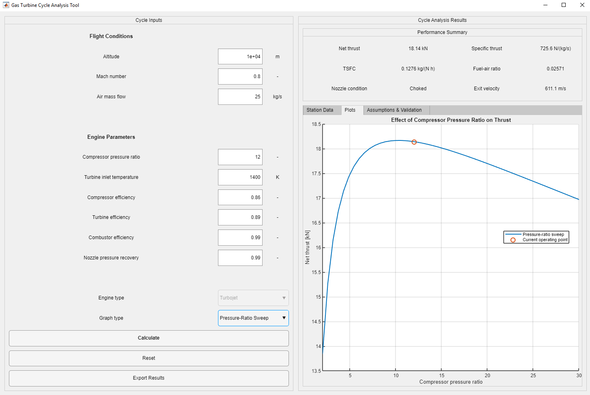

# Gas Turbine Cycle Analysis Tool

A MATLAB App Designer application for preliminary thermodynamic and performance analysis of a single-spool turbojet engine.

## Application Preview



## Features

- Steady, one-dimensional turbojet-cycle analysis
- International Standard Atmosphere model from 0 to 20 km
- Compressor, combustor, turbine, and convergent-nozzle models
- Automatic nozzle-choking detection
- Calculation of:
  - Net thrust
  - Specific thrust
  - Thrust-specific fuel consumption
  - Fuel–air ratio
  - Nozzle exit velocity
  - Station total temperatures and pressures
- Parametric studies for:
  - Compressor pressure ratio
  - Flight altitude
  - Flight Mach number
  - Turbine inlet temperature
- Excel export of performance results and station data
- Input validation and error handling

## Model Assumptions

- Steady and one-dimensional flow
- Single-spool turbojet configuration
- Constant specific heats and heat-capacity ratios
- Separate thermodynamic properties for air and combustion gas
- Prescribed component efficiencies and pressure recoveries
- Turbine power matched to compressor power
- Convergent nozzle with choking detection
- No cooling flow, bleed flow, accessory loads, or afterburner
- Parametric sweeps are preliminary sensitivity studies rather than full off-design predictions
- Compressor and turbine performance maps are not included

## Verification

The numerical implementation was verified using:

- Turbine–compressor shaft-power balance
- Independent recovery of compressor efficiency
- Independent recovery of turbine efficiency
- Nozzle-choking criterion
- Independent reconstruction of momentum and pressure thrust

The shaft-power residual for the reference case was approximately:

```text
4.9 × 10^-16
